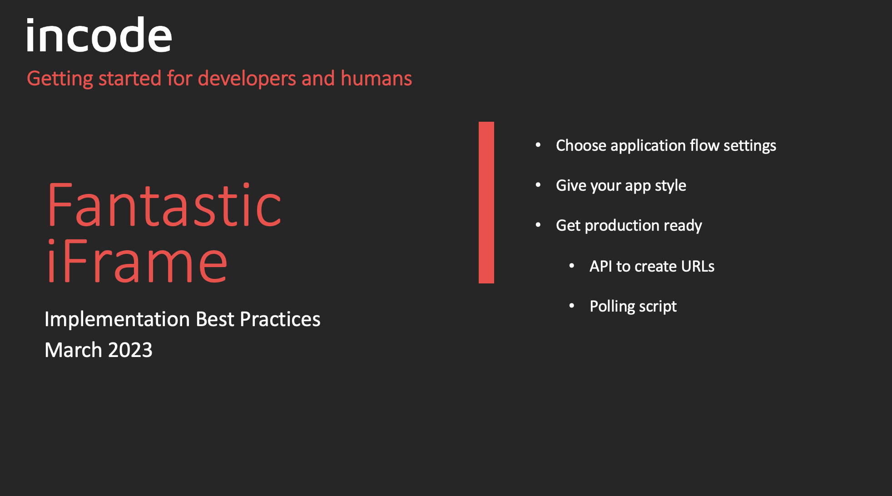

# IFrame Starter Kits 

__Get implemented in 30 minutes__

<br>



# Setup Recomendations

* Visual Studio Code (Text Editor)

<br>


# Getting Started

This sample includes two implementations using HTML IFrames.


## IFrame Basic Implementation

* Document where to get Incode's iFrame snippit
* Full HTML file with Iframe snippt plus special meta tag

## IFrame Best Pratices
* Best practice for backend coding (choose a backend sample, python, java, note, .net)
    *   omni/start
    *   omni/onboarding-url
    *   web hook
* Document where to get Incode's iFrame snippit
* Full HTML file with Iframe snippt plus special meta tag
* Outter iFrame Incode API polling for status script
* Completion page


### Polling for status reference

````js

// interviewId and accessToken come from the backend
const flow = { id: interviewId, key: accessToken }
 
const interval = setInterval(heartbeat, 2000, flow); //Poll every two seconds
 
const heartbeat = async (flow) => {
    const results = await getStatus(flow);
    if (results.onboardingStatus === 'ONBOARDING_FINISHED') {
        // This is an opertunity to progress forward.
        // At this point identity proofing is complete
    }
}
 
const getStatus = (flow) => {
    const statusUrl = `${flow.apiUrl}/omni/get/onboarding/status?id=${flow.id}`;
    return fetch(statusUrl, {
        method: 'GET',
        headers: {
            'Content-Type': 'application/json',
            'X-Incode-Hardware-Id': flow.key,
            'api-version': '1.0'
        }
    })
        .then((response) => response.json())
        .catch((error) => {
            console.error('Error:', error);
        });
}
 

````


### Reference HTML Page w/ Incode iFrame 

````html

<!DOCTYPE html>
<html>
<head>
    <title>Example</title>
    <meta name="viewport" content="width=device-width, initial-scale=1.0, maximum-scale=1.0, user-scalable=no" />
    <style>
        html,
        body {
            height: 100%;
        }
    </style>
</head>

<body>
    <iframe title="onboarding"
        src="https://saas-onboarding.incodesmile.com/launchpad/flow/6397638f21886bb3d4648bfd/uuid/99a3ebbf-3757-4bca-85d4-9a05b06b1819/tag/verification?client=incode&components=qr"
        height="667" width="375" frameborder="0" allowusermedia allow="geolocation; microphone; camera;" style="
      position: absolute;
      top: 0;
      left: 0;
      right: 0;
      bottom: 0;
      height: 100%;
      width: 100%;
    "></iframe>
</body>

</html>

````
